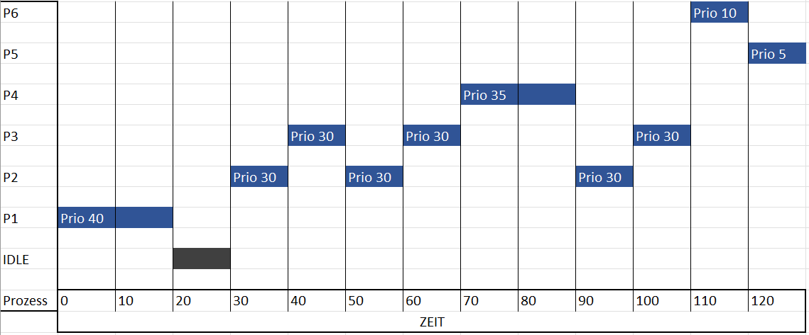

# Scheduling

Löse folgende Aufgabe für verschiedene Scheduling Algorithmen:

- [Priority based, preemptive, round robin](https://en.wikipedia.org/wiki/Fixed-priority_pre-emptive_scheduling)
- [Completely Fair Scheduler](https://en.wikipedia.org/wiki/Completely_Fair_Scheduler)
- [Multilevel Feedback Queue](https://de.wikipedia.org/wiki/Multilevel_Feedback_Queue)

| Bezeichner | Priorität | CPU Zeit | Ready Zeit |
|------------|-----------|----------|------------|
| P1         | 40        | 20       | 0          |
| P2         | 30        | 25       | 25         |
| P3         | 30        | 25       | 30         |
| P4         | 35        | 15       | 60         |
| P5         | 5         | 10       | 100        |
| P6         | 10        | 10       | 105        |

Jeder Prozess hat eine Priorität, wobei eine höhere Zahl eine höhere Priorität bedeutet.
Zusätzlich zu den aufgeführten Prozessen existiert ein Idle-Task, der ausgeführt wird, wenn keine anderen Prozesse
verfügbar sind.
Er besitzt Priorität 0.

Der Scheduler wird alle 10 Zeiteinheiten ausgeführt.

1. Zeichne ein Gantt Diagramm für die Prozessabfolge.

2. Wie hoch ist die CPU-Auslastung?

Für die gesamte Operation benötigt der CPU 12 Sekunden. Dabei ist dieser nur 1 Sekunde im idle, respektive ist die Belastung nur 11 Sekunden lang.

Dies ergibt eine CPU-Auslastung von 100% / 12s x 11s = 91.667%
   
3. Wie gross ist die Wartezeit für jeden Prozess?
   
P1: Startet bei Zeit 0 und war bereit bei Zeit 0. \( \text{Wartezeit} = 0 - 0 = 0 \) Zeiteinheiten.
P2: Startet bei Zeit 25 und war bereit bei Zeit 25. \( \text{Wartezeit} = 25 - 25 = 0 \) Zeiteinheiten.
P3: Startet bei Zeit 50 und war bereit bei Zeit 30. \( \text{Wartezeit} = 50 - 30 = 20 \) Zeiteinheiten.
P4: Startet bei Zeit 75 und war bereit bei Zeit 60. \( \text{Wartezeit} = 75 - 60 = 15 \) Zeiteinheiten.
P5: Startet bei Zeit 100 und war bereit bei Zeit 100. \( \text{Wartezeit} = 100 - 100 = 0 \) Zeiteinheiten.
P6: Startet bei Zeit 110 und war bereit bei Zeit 105. \( \text{Wartezeit} = 110 - 105 = 5 \) Zeiteinheiten.
